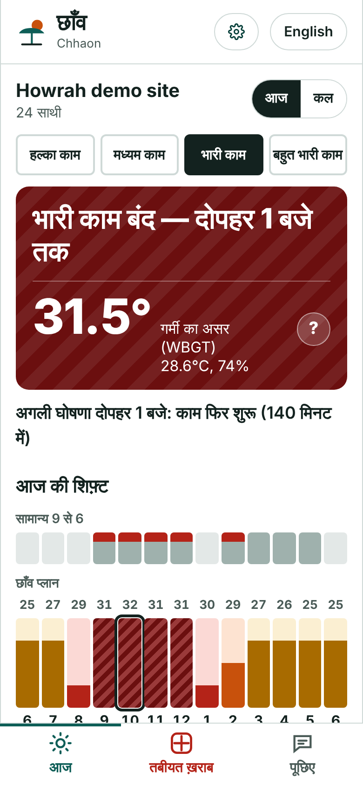
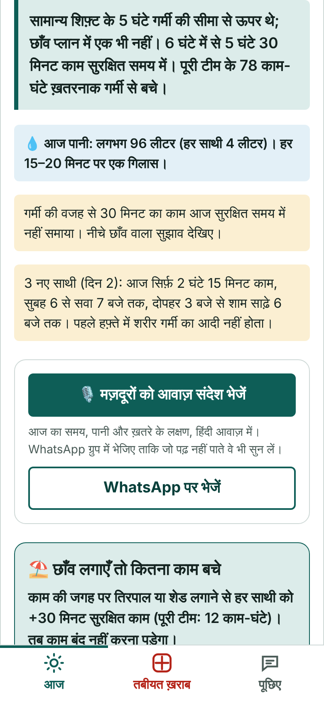
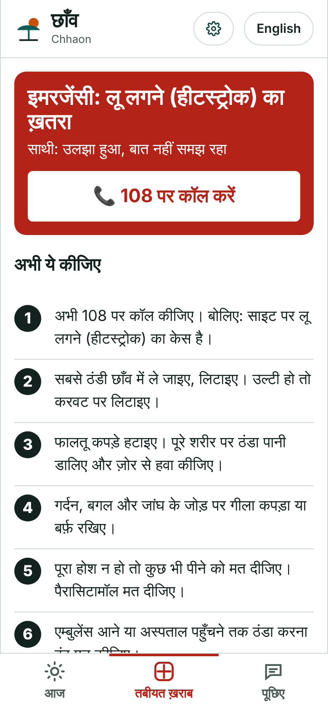
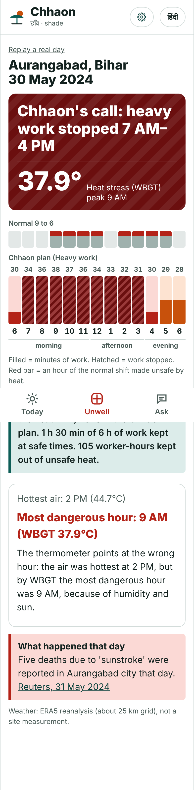

# Chhaon (छाँव)

**Heat-safe shifts for India's outdoor workers.** Chhaon turns a construction site's weather forecast into an hour-by-hour work plan, calls every break in Hindi through a speaker on site at the minute it is due, sends the crew a voice note they can listen to without reading, and walks the supervisor through first aid when a worker gets sick from the heat.

Environmental Hacks, Bharat Builds Tour 2026 · **Track: Heat and Water** (heatwaves)

- **Live app:** https://d2cvj3mcid9pim.cloudfront.net (tap "Open the demo site"; no sign-up)
- **Demo video:** _added after recording_
- **Architecture:** [docs/ARCHITECTURE.md](docs/ARCHITECTURE.md)

<p>




</p>


---

## The problem

India's Health Ministry counted **110 confirmed heatstroke deaths and over 40,000 suspected cases** between 1 March and 18 June 2024 ([AP](https://abcnews.go.com/International/wireStory/extreme-heat-india-killed-100-people-past-half-111271458)). On 30 May 2024 alone, ten deaths from suspected heatstroke were reported at the government hospital in Rourkela, Odisha, and the state barred its own employees from outdoor work between 11 AM and 3 PM ([Reuters via Business Standard](https://www.business-standard.com/india-news/15-succumb-to-suspected-heatstroke-in-bihar-odisha-over-24-hours-124053100673_1.html)). The ILO projects that heat stress will cost India **5.8% of its working hours in 2030**, the equivalent of 34 million full-time jobs, with construction and farm work hit hardest ([ILO, *Working on a warmer planet*, 2019, via Down To Earth](https://www.downtoearth.org.in/amp/story/lifestyle/heat-stress-singes-india-most-ilo-pegs-cost-at-34-mn-jobs-in-2030-65380)).

On a construction site the decision of when to stop is made by a site supervisor (munshi) with a phone, usually from the thermometer reading or not at all. Two things go wrong:

1. **Temperature is the wrong number.** Heat illness depends on WBGT (wet bulb globe temperature), which adds humidity, sun and wind. A humid 29°C morning in full sun can be past the limit for heavy work while the thermometer says it is fine.
2. **Rest costs wages.** Workers paid by the day don't stop because a lost hour is lost pay. A rule that only says "stop" gets ignored.

## What Chhaon does

| For the supervisor and the crew | How |
|---|---|
| **Today's plan, hour by hour** | Modelled WBGT for every hour from the site's forecast, the safe share of each hour for the crew's workload, and a shift that keeps the normal 9-to-6 hours where they are safe and moves the unsafe minutes into the coolest hours. It says how many normal-shift hours were over the limit (none are in the plan), how much paid work it kept, and how much water the crew needs. |
| **Keep the pay: the shade option** | The same day re-planned as if a tarpaulin covered the work area, so the supervisor sees what shade is worth ("+1 h 30 min of safe work per worker"). |
| **New workers protected** | Workers in their first week get the stricter limits and NIOSH's acclimatisation ramp (20% of a normal day on day 1, +20% a day). Their day on site counts up by itself. |
| **Breaks called on time, in Hindi** | Every rest, stop and restart is an EventBridge Scheduler timer. When it fires, Amazon Polly (Kajal) speaks it in Hindi and the phone plays it through a site speaker, on any screen, with the screen kept awake. The day's audio is cached on the phone, so breaks are still called if the network drops. The last announcement tells the crew when work starts tomorrow. |
| **A voice note for the crew** | One tap shares the day's plan as a Hindi voice note to the crew's WhatsApp group: start time, the stop, water, warning signs, 108. Workers who don't read can listen. |
| **Someone feels unwell** | A 108 button at the top. Tap the symptoms; triage and first aid follow India's [National Action Plan on Heat Related Illnesses](https://ncdc.mohfw.gov.in/wp-content/uploads/2024/05/1.Nation-Action-plan-on-Heat-Related-llnesses.pdf), shown instantly from a copy on the phone even with no network. A Step Functions workflow waits 30 minutes, asks for a re-check and escalates anything not clearly better: call 108, nearest hospitals from Amazon Location, email to the safety officer. |
| **Ask in Hindi or English, by voice** | Tap 🎤 and say "कल दोपहर 2 बजे ढलाई कर सकते हैं?": Amazon Transcribe turns Hindi speech into text, a Strands Agents agent on Amazon Bedrock answers by running the planner as a tool and shows its working (`check_task(day=tomorrow, start_hour=14, hours=2)`), and Polly reads the answer back. For first aid, the guideline's own steps are shown and spoken, not the model's paraphrase. |
| **Replay a real day** | The planner run on the actual weather of 30 May 2024 in Rourkela and Aurangabad. |

It is built for the person using it: Hindi first with times as people say them ("दोपहर 1 बजे", not "13:00"), readable in direct sunlight (white background, large type, hatching as well as colour), big touch targets, three tabs, no sign-up, works on a cheap Android phone and keeps the last plan when the network drops.

## Where AWS fits

Each service does a job you can see in the demo. Details in [docs/ARCHITECTURE.md](docs/ARCHITECTURE.md).

| Service | Its job in Chhaon |
|---|---|
| **AWS Lambda** (Python 3.12, arm64) | The planner: WBGT physics, limits and shift optimiser. Deterministic and unit-tested; the same code serves the API, the timers and the agent's tools. |
| **Amazon EventBridge Scheduler** | One one-time `at()` schedule per announcement, in Asia/Kolkata time, deleted after it fires; a 05:00 IST daily schedule plans every registered site. Nothing runs between breaks. |
| **AWS Step Functions** | The heat-illness protocol: first aid, a 30-minute wait, a re-check that pauses on a task token until the supervisor answers, escalation on "same", "worse" or silence. |
| **Amazon Polly** | Hindi announcements and the crew's voice note (Kajal, neural). Each sentence is synthesised once and cached in S3; the whole day is synthesised when announcements are turned on, so the phone can cache it. |
| **Amazon Bedrock** + **Strands Agents SDK** | The Hindi/English assistant. A Strands agent with three tools (today's plan, check a task window, first aid) on OpenAI's open-weight gpt-oss-120b, called through Bedrock's OpenAI-compatible endpoint in ap-south-1 and signed with the Lambda's IAM role (SigV4, no API keys). If it can't answer in 18 s, a plain tool loop on the same model, then a labelled rule-based answer. |
| **Amazon Transcribe** (streaming, `hi-IN`) | Spoken questions: the phone streams the microphone straight to Transcribe over a WebSocket that the API signs for five minutes. A supervisor who doesn't type Devanagari can just ask. |
| **Amazon Location Service** | Find the site by name; nearest hospitals for an emergency. |
| **Amazon DynamoDB** | Sites, plans, the announcement feed and incidents in one table, with TTL on health data; once-per-day markers so impact is never double-counted. |
| **Amazon CloudFront + S3** | The app and the cached audio, served from India edge locations; `/api/*` routed to the HTTP API. |
| **Amazon API Gateway** (HTTP API) | Throttled public API; per-IP rate limits for the routes that cost money. |
| **Amazon SNS + CloudWatch** | Safety-officer emails; alarms on errors and failed protocol runs; a dashboard of worker-hours kept out of unsafe heat (real sites and demo sites counted separately), announcements sent and actually played on site, and answers by engine. |
| **AWS SAM / CloudFormation** | The whole stack in one template, least-privilege IAM per function (functions can write only `audio/` in the web bucket). |

**Deliberately not used:** SMS (Indian SMS needs TRAI DLT sender and template registration, which takes longer than a hackathon); SageMaker (there is no model to train: physics and published limits do the job); always-on servers (every component is pay-per-use).

## What the real data showed

We ran the planner on the actual (ERA5) weather of 30 May 2024, for heavy work. All WBGT values are modelled from weather data, not measured.

- **Aurangabad, Bihar:** the air was hottest at 14:00 (44.7°C), but by WBGT the most dangerous hour was **09:00** (37.9°C): humid, still morning air in full sun. At 14:00, WBGT was 32.4°C. Heavy work should have stopped from 07:00 to 16:00.
- **Rourkela, Odisha:** heavy work was past the safe limit from **06:00 to 17:00**. The official 11:00–15:00 ban covered four of those eleven hours.
- **Howrah, 8 October 2026** (the day we started): air 29°C at 09:00, WBGT 33.6°C. Five hours of a normal heavy-work shift were over the limit; the plan pauses heavy work 08:00–13:00 and keeps 4 h 30 min of the 6 h of work. Under a tarpaulin, the estimate is the full shift with no pause.

The thermometer points at the wrong hour. These checks are in `backend/tests/test_real_data.py`.

## Method

- **WBGT.** Outdoor WBGT = 0.7 natural wet bulb + 0.2 globe + 0.1 air temperature, computed with a port of Liljegren et al. (2008), *Modeling the Wet Bulb Globe Temperature Using Standard Meteorological Measurements*, J. Occup. Environ. Hyg. 5(10). Inputs from the [Open-Meteo](https://open-meteo.com/) forecast: temperature, humidity, 10 m wind (reduced to 2 m), shortwave and direct radiation, pressure, and the sun's position for each hour. **What is validated:** the psychrometric wet bulb matches Open-Meteo's own wet-bulb output (mean −0.05°C, worst 0.46°C over 96 hours); the globe and natural wet-bulb parts follow the published model but have not been checked against an on-site WBGT meter.
- **Limits.** ACGIH heat-stress screening criteria, as published by [CCOHS](https://www.ccohs.ca/oshanswers/phys_agents/heat/heat_control.html): the WBGT at which 75–100%, 50–75%, 25–50% or 0–25% of each hour may be worked, by workload, for acclimatised workers (TLV) and new workers (Action Limit). An hour counts as unsafe only when the heat cuts it below what that workload is allowed on a cool day (heavy work is never screened for a full hour, so its normal hour is 45 minutes of work).
- **Acclimatisation.** [NIOSH](https://www.cdc.gov/niosh/heat-stress/recommendations/acclimatization.html): new workers 20% on day 1 and +20% a day, applied only on days when the heat limits them at all.
- **Water.** NIOSH: a cup (about 240 ml) every 15–20 minutes of work in the heat.
- **First aid.** India's [National Action Plan on Heat Related Illnesses](https://ncdc.mohfw.gov.in/wp-content/uploads/2024/05/1.Nation-Action-plan-on-Heat-Related-llnesses.pdf) (NCDC, MoHFW).

## Run it

**Without AWS** (real handlers, in-memory fakes, synthetic or saved weather):

```bash
python dev/server.py          # http://localhost:8787
cd backend && python -m unittest discover -s . -p "test_*.py"
```

**On AWS** (AWS CLI v2):

```powershell
powershell -ExecutionPolicy Bypass -File scripts\jobs\deploy.ps1 -Region ap-south-1 -AlertEmail you@example.com
```

`deploy.ps1` packages `infra/template.yaml`, deploys the stack, and publishes `web/` to S3 behind CloudFront. `strands-layer.ps1` builds the Strands Agents layer. After changing `backend/chhaon/protocol.py`, run `python scripts/gen_protocol_js.py` (a test fails if the phone's offline copy differs).

## Limits, honestly

- The forecast is for the area (a few km), not one spot; a WBGT meter on site is better. Modelled WBGT is sensitive to very low wind and to cloud in the forecast. The ACGIH table is a screening tool, not a prescription. Chhaon is not a medical device; in an emergency, call 108.
- The shade option removes the sun's load only; a tin roof or a hot slab adds heat the model doesn't see.
- Replays use ERA5 reanalysis (about a 25 km grid), not station measurements.
- Safety-officer alerts go to one address per deployment (the stack's SNS topic), not per site.
- Demo sites compress the 30-minute re-check to 20 seconds so it can be seen in a demo.
- Voice is Hindi and Indian English: those are the Indian languages Amazon Polly speaks today. Many crews speak Bhojpuri, Bengali or Odia.
- Not yet tested with a supervisor on a working site.

## Built with

Python, plain JavaScript (no framework, no build step), AWS. AI tools used: **Claude (Anthropic)** as a coding agent. Inside the product, **gpt-oss-120b on Amazon Bedrock** writes the assistant's answers; it never makes a safety decision.

MIT licence. Built by Souvik Ghosh during Environmental Hacks, 8–11 October 2026.
