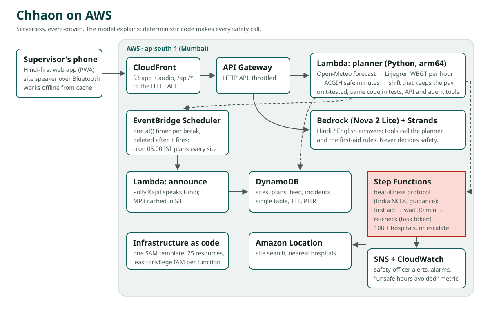

# Architecture



Chhaon is serverless and event-driven. Nothing runs between breaks: a plan is computed on request, each announcement is a one-time timer, and a heat-illness case is a workflow that waits without holding a server. Region: **ap-south-1 (Mumbai)**, close to the users and the data.

## One rule

**The model explains; code decides.** WBGT, work/rest limits, the shift plan, triage and escalation are deterministic Python with unit tests (including checks against real weather). The Bedrock agent can only read their output through tools. Safety-critical announcements and the crew's voice note are fixed templates, never generated text, so the same instruction always sounds the same; when the assistant is asked about first aid, the guideline's own steps are shown and spoken next to its answer.

## Flows

### 1. Plan a day
`GET /api/sites/{id}/plan?day=today`
1. API Lambda loads the site from DynamoDB.
2. Fetches the Open-Meteo hourly forecast (cached in DynamoDB for an hour per location).
3. For each hour slot: averages the instantaneous variables at both ends, takes radiation from the next record (it is a preceding-hour mean), places the sun at the slot's midpoint, and computes outdoor WBGT with the Liljegren model (10 m wind reduced to 2 m with a stability class, urban exponents).
4. Looks up the safe share of the hour for the workload and acclimatisation (ACGIH screening table; Action Limit for new workers; NIOSH exposure ramp).
5. Keeps the normal 9-to-6 hours where they are safe, then moves the unsafe minutes into the coolest hours of the allowed window (06:00–19:00, or 05:00–22:00 with night work), never above the safe share. "Normal" is what the workload is allowed on a cool day (heavy work: 45 minutes an hour), so only heat, not the workload itself, makes an hour unsafe.
6. Builds the announcement list: work start, each rest, the long pause and its end, day end.
7. Adds the decision aids: worker-hours kept out of unsafe heat, water for the crew (a cup every 15–20 minutes of work), and the **shade option**: the same day re-planned with the sun's load removed, so the supervisor sees what a tarpaulin is worth in paid work.
8. New workers' day on site is counted from `new_workers_since`, so the NIOSH ramp advances by itself; it applies only on days when the heat limits them at all.

### 2. Announce on time
`POST /api/sites/{id}/publish` and the 05:00 IST daily schedule
- For each future announcement, the API creates an **EventBridge Scheduler** one-time schedule: `at(2026-10-09T10:45:00)` in `Asia/Kolkata`, flexible window off, retry twice, `ActionAfterCompletion: DELETE`. Re-publishing deletes and recreates that day's schedules, so there are never duplicates.
- Publishing also synthesises every announcement of the day with **Polly** (in parallel; each sentence once, cached in S3) and returns the audio list. The phone caches it through the service worker.
- When a schedule fires, the **announce Lambda** renders the fixed Hindi template (times as people say them: "दोपहर 1 बजे तक"), gets the audio from S3 (or Polly), and appends the announcement to the site feed in DynamoDB. The day's last announcement includes tomorrow's start time.
- While announcements are on, the phone polls the feed every 10 seconds **on every screen** (a bar at the top says so) and plays new audio through the site speaker; a Wake Lock keeps the screen on. If an announcement hasn't arrived a minute after it was due (no network), the phone plays the cached audio itself. Each playback is reported (`POST /played`), so the dashboard shows announcements sent *and* actually played on site.
- `POST /test-announcement` creates a real schedule 60 seconds out, so anyone can watch the whole path work.
- `POST /brief` builds the crew's voice note: a fixed Hindi template with the day's start, stop windows, end, water and warning signs, synthesised by Polly and shared to WhatsApp from the phone's share sheet.

### 3. Someone is unwell
`POST /api/sites/{id}/incidents` starts a **Step Functions** Standard workflow:

```
Begin → Triage ─red──────────────────────────────→ Emergency → AwaitHandover (task token) → HandedOver
              ├─amber/yellow→ FirstAid → Wait 30 min → Recheck (task token) → Decide ─better→ Recovered
              │                                                              ├─worse/same→ Emergency
              │                                                              └─(yellow, same)→ FirstAid
              └─green→ Advice                       timeouts on Recheck / AwaitHandover → Escalate
```

- Every step writes to the incident timeline in DynamoDB, which the phone shows live.
- A re-check is a `waitForTaskToken` task: the token is stored server-side and never sent to the browser; the supervisor's answer calls `SendTaskSuccess`.
- Emergency finds the nearest hospitals with **Amazon Location** (Places `SearchNearby`, category hospital) and emails the safety officer through **SNS**.
- Escalation is conservative: anything other than "better" goes up a level, and silence escalates.
- Demo sites wait 20 seconds instead of 30 minutes.
- **No network:** the same triage rules and steps are generated into `web/protocol.js` from `protocol.py` (a unit test fails if they differ), so the phone shows the right first aid and the 108 button instantly; the report is queued and sent when the network returns.

### 4. Ask
`POST /api/ask` runs a separate Lambda with **Amazon Bedrock**. Tools: `day_plan`, `check_task`, `first_aid`, all backed by the same planner code.

- **Speaking instead of typing:** `POST /api/listen` returns a WebSocket URL for **Amazon Transcribe streaming** (`hi-IN` or `en-IN`, 16 kHz PCM), SigV4-signed with the API function's role and valid for five minutes. The phone captures the microphone, frames the audio in AWS's event-stream format (`web/listen.js`) and streams it straight to Transcribe; partial text fills the question box and the final text is asked. Audio never passes through our servers. If the stream can't start, the browser's own speech recogniser is used.

- **Model:** OpenAI's open-weight **gpt-oss-120b** on Bedrock's OpenAI-compatible endpoint in Mumbai (`bedrock-mantle.ap-south-1.api.aws/v1`). Every request is signed with SigV4 using the function's IAM role (`bedrock-mantle:CreateInference`), so there is no API key to store or leak. In a comparison on the same Hindi question, gpt-oss-120b, Qwen3 235B, Mistral Large 3 and gpt-oss-20b all chose the right tool; gpt-oss-120b was the fastest (about 1 s for both rounds) and is the default (template parameter `MantleModel`).
- **First engine: Strands Agents SDK.** A Strands `Agent` with the three tools as `@tool` functions and Strands' OpenAI-compatible model provider pointed at that endpoint (an `httpx` auth hook adds the SigV4 signature). The SDK ships as a Lambda layer (`strands-layer.ps1`).
- **Second engine:** the same model with a small hand-written tool loop (up to 5 rounds), in case the layer is missing or fails. Then Strands/Converse with Nova 2 Lite on bedrock-runtime, for accounts whose bedrock-runtime quotas allow it (this account's are 0).
- **Evidence:** every tool call is recorded with its arguments and shown under the answer, e.g. `check_task(day=tomorrow, start_hour=14, hours=2)`, with the engine and model. When `first_aid` was used, the guideline's fixed steps travel with the answer and are what "Hear the answer" speaks.
- **Guard rails:** an 18-second deadline across engines; a throttled or failing backend is skipped for a minute or more; if nothing answers, a rule-based answer from the same tools is returned and labelled "AI model unavailable". A CloudWatch metric counts answers by engine.

## Data model (one DynamoDB table)

| PK | SK | What | Expires |
|---|---|---|---|
| `SITE#<id>` | `META` | site settings | 30 days (demo: 7) |
| `SITE#<id>` | `PLAN#<date>` | plan + schedule names | 7 days |
| `SITE#<id>` | `FEED#<iso>#<id>` | announcements, alerts | 3 days |
| `INC#<id>` | `META` | incident, timeline, pending question | 30 days |
| `ACTIVE` | `SITE#<id>` | sites the morning job plans | with the site |
| `WX#<lat>#<lon>` | `HOUR#<yyyymmddhh>` | forecast cache | 1 hour |
| `RL#<key>` | `MIN#<minute>` | per-IP rate limit counters | 2 minutes |
| `ONCE#<key>` | `ONCE` | "already counted" markers (a site-day's impact metric) | 3 days |

Incidents use optimistic locking (`v` attribute) because the workflow and the supervisor can write at the same time.

## Security and reliability

- Least-privilege IAM per function: only the API and morning functions can create schedules, only in their group; only the Scheduler role can invoke the announce function; functions can read and write only `audio/` in the web bucket, never the app itself.
- Impact metrics are emitted once per site per day (a conditional write in DynamoDB), with real sites and demo sites as separate dimensions, so demo clicks can't inflate the dashboard.
- HTTP API throttling plus per-IP limits in DynamoDB for the routes that cost money (Bedrock, Polly) or create resources.
- S3 is private behind CloudFront Origin Access Control; security headers via the managed policy.
- No accounts or personal data beyond a worker's first name in an incident, which expires after 30 days.
- Alarms: API errors and any failed protocol run notify the alert topic. X-Ray tracing on all functions and the state machine. Log retention 14 days.
- A $15 monthly budget alert.

## Cost shape

Everything is pay-per-use and idle costs nothing. Per site per day: one forecast call (cached), roughly 10–25 Scheduler invocations, the same number of short Lambda runs, Polly only for sentences not yet in the S3 cache (a site's announcements repeat, so after the first day only the voice note, about 400 characters, is new), and Bedrock only when someone asks a question (a few thousand tokens per answer). At list prices that is a few US cents per site per month, most of it Polly; Scheduler, Lambda and DynamoDB stay inside or near the free tier at this scale.

## Run without AWS

`python dev/server.py` runs the real handlers with in-memory fakes for DynamoDB, S3, Polly, Scheduler, Step Functions (a small interpreter of the same protocol), Location and SNS, and serves the app at http://localhost:8787.
